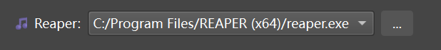
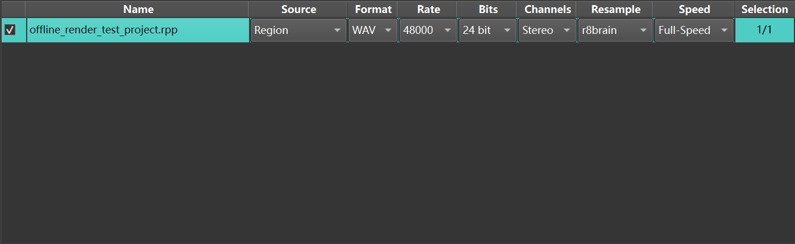
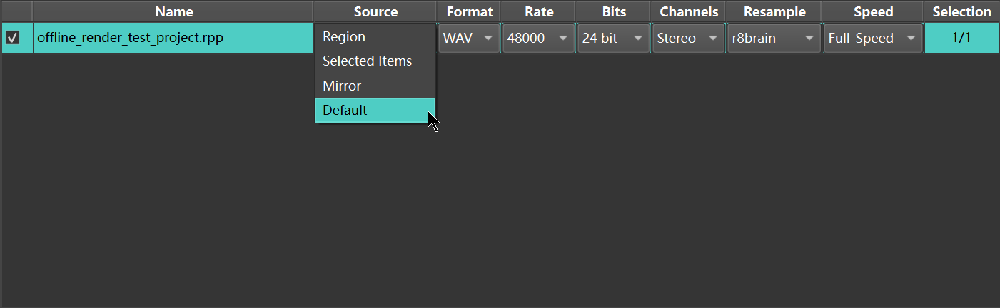
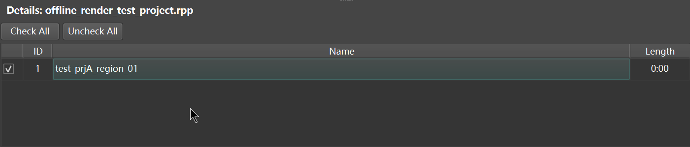
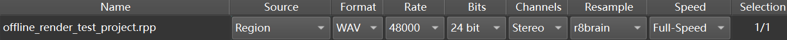
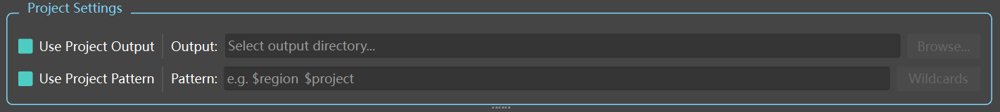
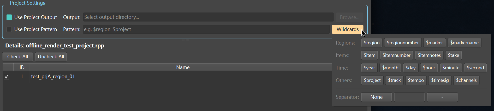
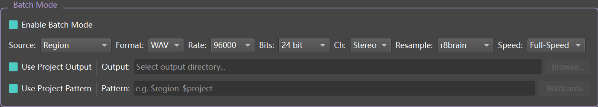
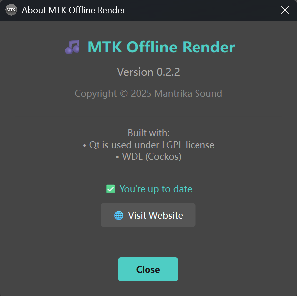

# MTK Offline Render - User Guide

A batch rendering tool for REAPER projects (.rpp files).

## Table of Contents

- [Quick Start](#quick-start)
- [Installation](#installation)
- [Loading Projects](#loading-projects)
- [Render Sources](#render-sources)
- [Audio Settings](#audio-settings)
- [Output Settings](#output-settings)
- [Batch Mode](#batch-mode)
- [MP4 Video Export](#mp4-video-export)
- [Wildcards Reference](#wildcards-reference)
- [Troubleshooting](#troubleshooting)

---

## Quick Start

1. Launch **MTK Offline Render**
2. Drag a folder containing `.rpp` files into the window
3. Select your REAPER executable path
4. Click **🚀 Render**

---

## Installation

### Requirements

- Windows 10/11
- REAPER (any recent version)

### Setup

1. Extract the downloaded archive to any location
2. Run `MTKOfflineRender.exe`
3. On first launch, the tool will auto-detect REAPER installation paths

If REAPER is not detected automatically, click the `...` button next to the REAPER dropdown to manually select `reaper.exe`.

---

## Loading Projects

### Method 1: Drag and Drop

Drag a folder containing `.rpp` files directly onto the application window.

### Method 2: Select Folder

Click **📁 Select Folder** and choose a folder. The tool will scan all subfolders recursively.

### Managing the File List

| Button | Function |
|--------|----------|
| **Check All** | Select all projects for rendering |
| **Uncheck All** | Deselect all projects |
| **Exclude Selected** | Remove highlighted rows from the list |
| **Clear List** | Remove all projects from the list |

---

## Render Sources

The **Source** column determines what content will be rendered from each project.

| Mode | Description |
|------|-------------|
| **Region** | Render each region as a separate file |
| **Selected Items** | Render selected items via master |
| **Default** | Use the project's existing render settings |

### Region Mode

When using **Region** mode:

1. Click on a project row to view its regions in the **Details** panel below
2. Check/uncheck individual regions to include or exclude them
3. The **Selection** column shows the count (e.g., "5/8" means 5 of 8 regions selected)

### Selected Items Mode

Renders items that are marked as selected in your REAPER project. Use this when you've pre-selected specific items in REAPER before saving the project.

---

## Audio Settings

Each project can have individual audio settings, or you can use **Batch Mode** to apply the same settings to all projects.

### Available Parameters

| Setting | Options |
|---------|---------|
| **Format** | WAV, MP4 |
| **Rate** | 44100, 48000, 88200, 96000, 176400, 192000 Hz |
| **Bits** | 8, 16, 24, 32 Int, 32 FP, 64 FP |
| **Channels** | Mono, Stereo, 4, 6, 8 |
| **Resample** | Sinc 192pt, 384pt, 512pt, 768pt, r8brain |
| **Speed** | Full-Speed, 1x Offline, Online, Offline Idle, 1x Idle |

> **Note:** When MP4 format is selected, the Bits setting is disabled (not applicable to video export).

---

## Output Settings

### Project Settings Panel

When you select a single project row (without Batch Mode), the **Project Settings** panel appears:

#### Output Path

- **Use Project Output** (checked): Uses the output path defined in the `.rpp` file
- **Use Project Output** (unchecked): Specify a custom output directory

#### Pattern

- **Use Project Pattern** (checked): Uses the filename pattern defined in the `.rpp` file
- **Use Project Pattern** (unchecked): Define a custom filename pattern using wildcards

Click **Wildcards** to insert variables like `$region`, `$project`, etc.

---

## Batch Mode

Batch Mode allows you to apply identical settings to all projects at once.

### Enabling Batch Mode

1. Check **Enable Batch Mode** in the Batch Mode panel
2. Configure all settings in one place
3. Individual column settings in the table will be hidden

### When to Use Batch Mode

| Scenario | Recommended Mode |
|----------|------------------|
| All projects need the same output format | ✅ Batch Mode |
| Each project needs different sample rates | ❌ Individual settings |
| Rendering a large number of similar projects | ✅ Batch Mode |

---

## MP4 Video Export

Select **MP4** as the output format to export video files.

### Fixed Video Parameters

| Parameter | Value |
|-----------|-------|
| Resolution | 1920 × 1080 |
| Frame Rate | 60 fps |
| Video Codec | H.264 |
| Video Bitrate | 10,000 kbps |
| Audio Codec | AAC |
| Audio Bitrate | 256 kbps |

> **Note:** These video parameters are fixed and cannot be customized in the current version.

---

## Wildcards Reference

Use these wildcards in your filename pattern:

### Regions

| Wildcard | Description |
|----------|-------------|
| `$region` | Region name |
| `$regionnumber` | Region number |
| `$marker` | Marker name |

### Items

| Wildcard | Description |
|----------|-------------|
| `$item` | Item name |
| `$itemnumber` | Item number |
| `$itemnotes` | Item notes |
| `$take` | Take name |

### Time

| Wildcard | Description |
|----------|-------------|
| `$year` | Year (4-digit) |
| `$month` | Month (2-digit) |
| `$day` | Day (2-digit) |
| `$hour` | Hour (24h) |
| `$minute` | Minute |
| `$second` | Second |

### Others

| Wildcard | Description |
|----------|-------------|
| `$project` | Project name |
| `$track` | Track name |
| `$tempo` | Project tempo |
| `$timesig` | Time signature |
| `$channels` | Number of channels |

### Separator

Choose a separator to automatically insert between wildcards:

- **None**: `$region$project`
- **Underscore**: `$region_$project`
- **Dash**: `$region-$project`

---

## Troubleshooting

### REAPER not found

**Symptom:** The REAPER dropdown is empty or shows an invalid path.

**Solution:** Click the `...` button and manually navigate to your `reaper.exe` file. Common locations:
- `C:\Program Files\REAPER (x64)\reaper.exe`
- `D:\Program Files\REAPER (x64)\reaper.exe`

### Render fails immediately

**Symptom:** Render starts but fails with an error code.

**Possible causes:**
1. The `.rpp` file is corrupted or has an incompatible format
2. REAPER is already running with the same project open
3. The output path is invalid or not writable

**Solution:** Try opening the project in REAPER manually to verify it loads correctly.

### Temporary files left behind

**Symptom:** You see files with `_mtktmp_` in the filename.

**Explanation:** These are temporary render files. The tool automatically cleans them up on startup. If they persist, you can safely delete them manually or move them to the Recycle Bin.

### No regions found

**Symptom:** The Details panel shows no regions for a project.

**Solution:** Ensure your REAPER project has regions defined (not just markers). In REAPER, regions have a start and end point, while markers are single points.

---

## Version Information

To check the current version and for updates:

1. Click the **ℹ️** button in the toolbar
2. The About dialog shows your version and checks for updates automatically

---

## Feedback & Support

If you encounter issues or have feature requests, please visit the [GitHub Issues](https://github.com/mantrikasound-dev/mantrikatools-OfflineRender-Tool/issues) page.

---

*MTK Offline Render v0.2.2*
